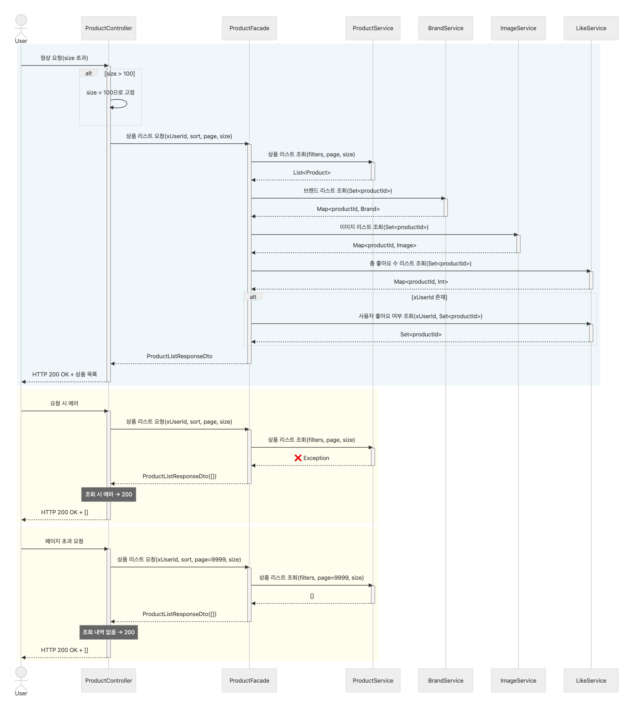
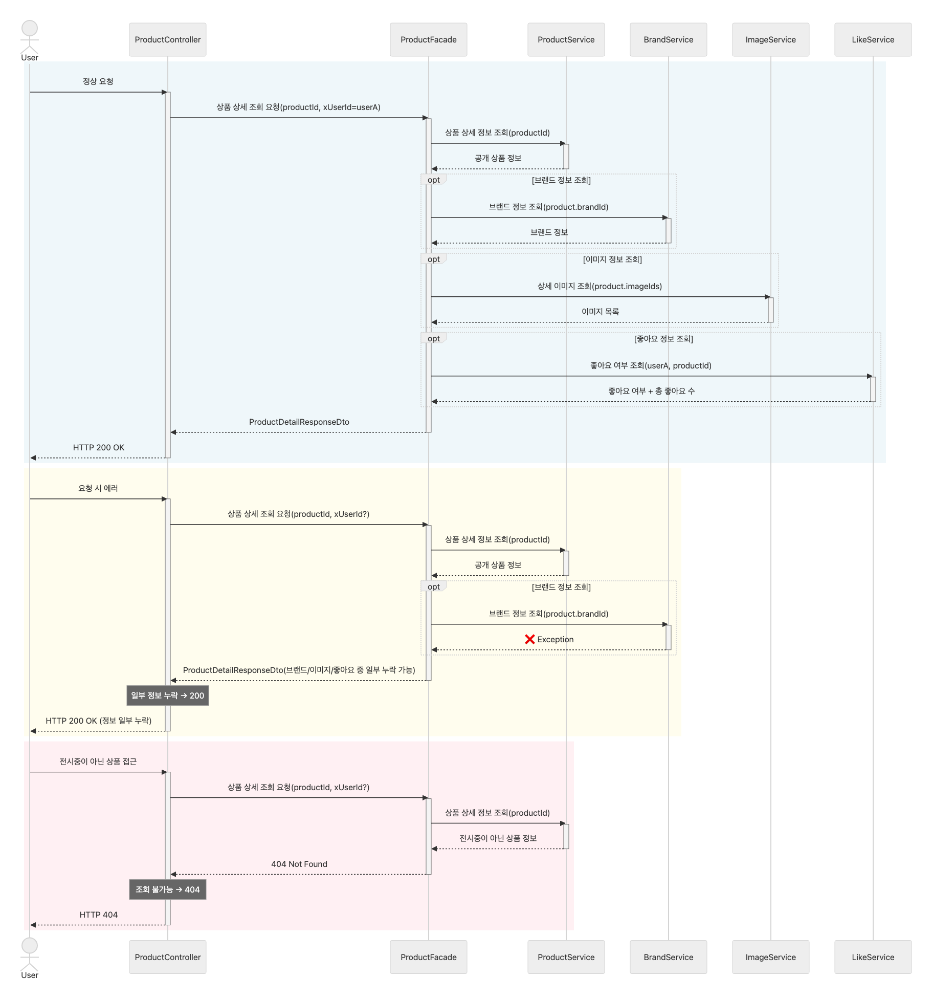
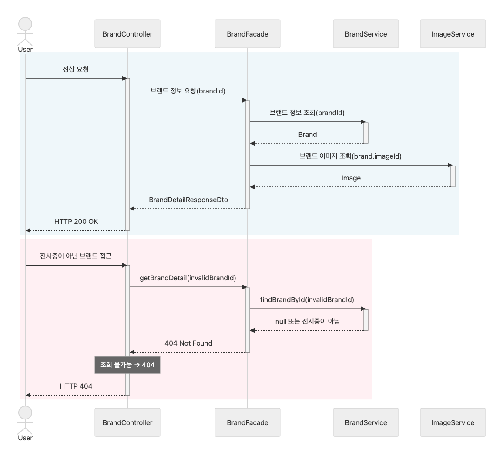
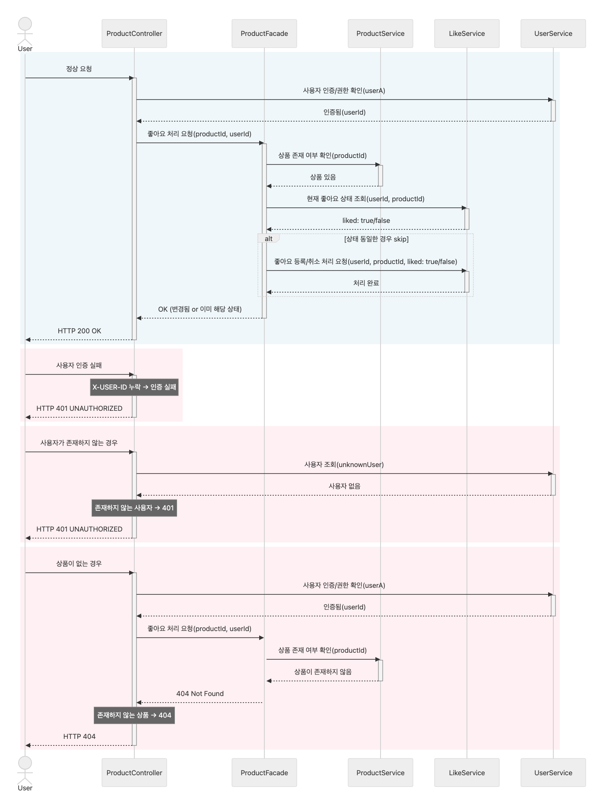
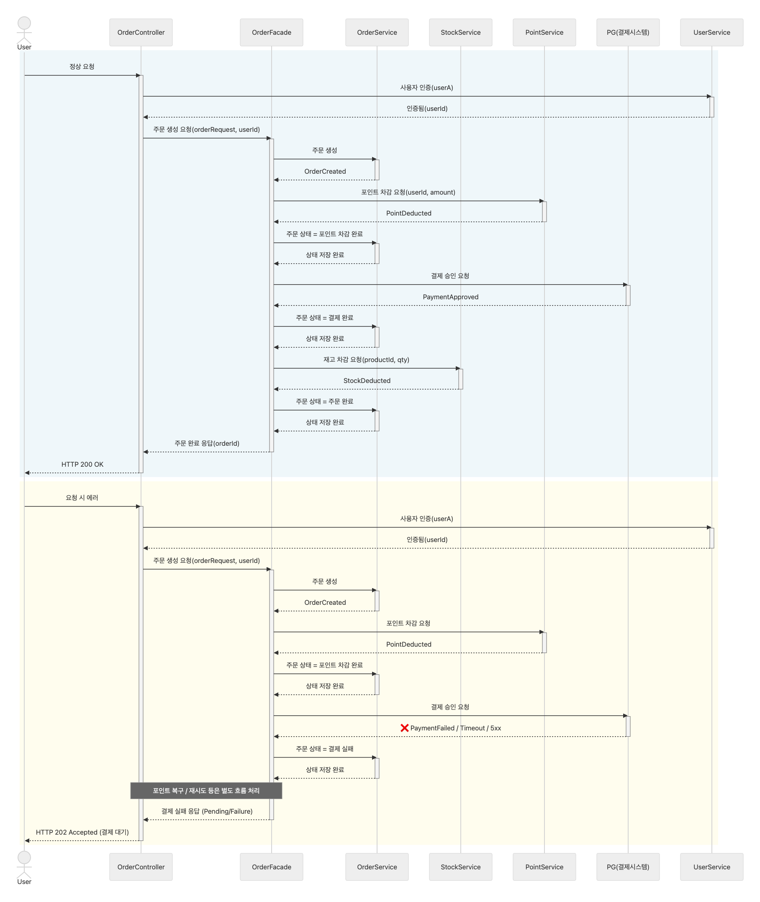

# 1. 상품 목록 / 상품 상세 / 브랜드 조회
- **Background color** 
  🟦해피패스 (Happy Path) 
  🟨예외적 정상 처리 
  🟥에러 상황

## 1-1. 상품 목록 조회

## 1-2. 상품 상세 조회

## 1-3. 브랜드 정보 조회

# 2.  상품 좋아요 등록/취소 (멱등 동작)
- Auth 처리용 파사드는 현 시점에서는 복잡도를 낮추기 위해 구현하지 않음.
  (단, 권한 확인 시 User가 아닌 userId 만을 반환하도록 함)

# 3. 주문 생성 및 결제 흐름 (재고 차감, 포인트 차감, 외부 시스템 연동)
