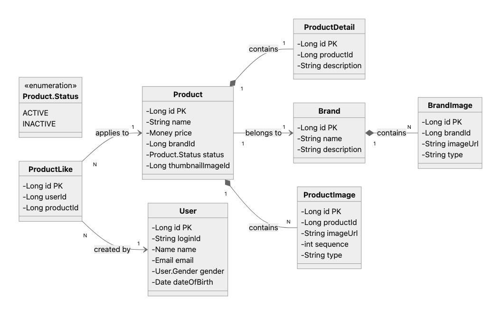
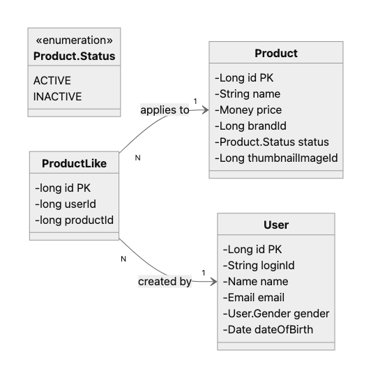
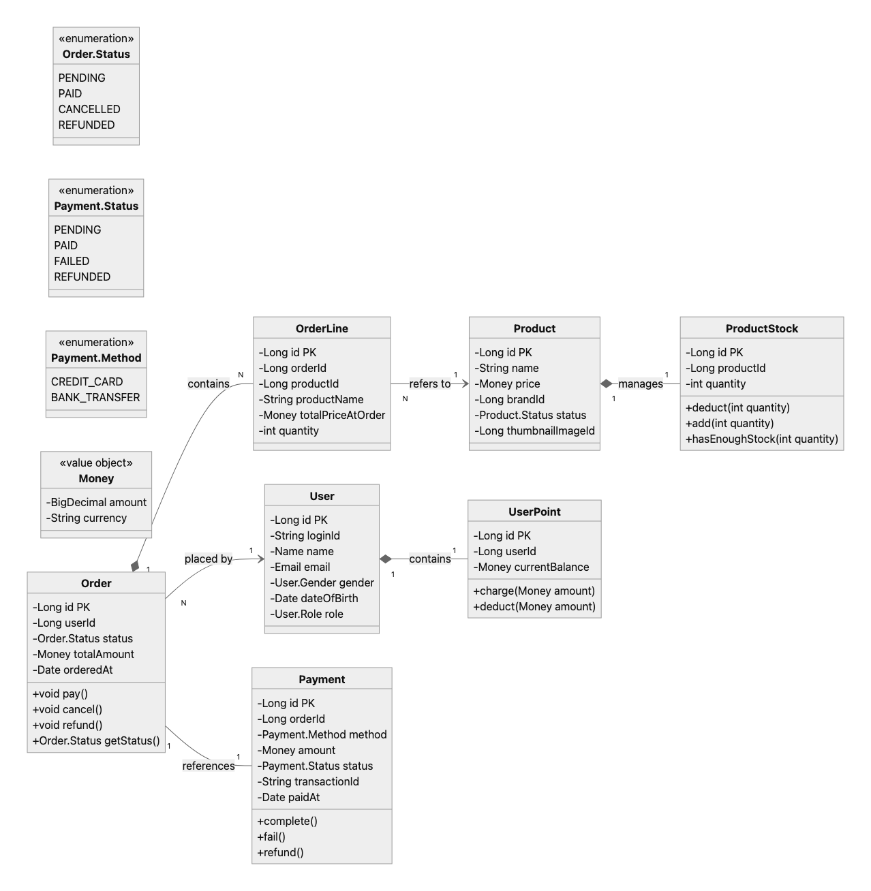

# 기본 개념 및 표기법

## 1.클래스 의존성 및 생명 주기

- **일반 연관 (Association)**
    - **기호:** `—-` 또는 `-->`
        - 한쪽 엔티티가 다른 쪽 엔티티의 인스턴스를 참조하거나 사용
        - **강한 생명 주기 종속성 없음**
- **합성 (Composition)**
    - **기호:** `*--`
        - 전체(Whole) 엔티티가 부분(Part) 엔티티를 **강하게 소유하고 구성**
          (부분은 전체 없이는 존재할 수 없음)
        - 부분은 일반적으로 공유되지 않으며 전체의 생명 주기에 종속

## 2. 관계 역할 이름(Role Name)

| **관계 표현** | **기호** | **설명** |
| --- | --- | --- |
| `placed by` | A → B | A가 B에 의해 **시작(개시)** 또는 **접수**됨 |
| `created by` | A → B | A는 B에 의해 **생성됨** |
| `applies to` | A → B | A는 B를 대상으로 발생하는 **이벤트 또는 명령** |
| `references` | A → B | A는 B를 **참조함** (필수 구성 요소 X, 약한 결합) |
| `belongs to` | A → B | A는 B의 **범주나 그룹에 소속** (강한 소유 X, 생명 주기 종속성 X) |
| `tracks` | A → B | A가 B의 이력을 추적 |
| `contains` | A *— B | A는 B를 **구성 요소로 포함** (강한 소유 O, 생명 주기 종속성 O) |
| `manages` | A *— B | A는 B의 **상태 및 동작을 포함한 전반을 관리** (포함 이상의 의미) |

---

# 클래스 다이어그램
- 히스토리는 다이어그램 간략화를 위해 생략함.
# 1. 상품 목록 / 상품 상세 / 브랜드 조회

# 2.  상품 좋아요 등록/취소 (멱등 동작)

# 3. 주문 생성 및 결제 흐름 (재고 차감, 포인트 차감, 외부 시스템 연동)
